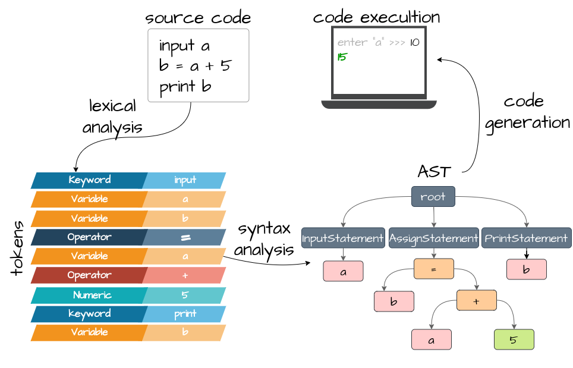

# Toy language



#### There are tutorials you can read to get detailed explanation about creation your own programming language:
1) [Part I - Building Your Own Programming Language From Scratch](https://hackernoon.com/building-your-own-programming-language-from-scratch)
2) [Part II - Dijkstra's Two-Stack Algorithm](https://hackernoon.com/building-your-own-programming-language-from-scratch-part-ii-dijkstras-two-stack-algorithm)
3) [Part III - Improving Lexical Analysis with Regex Lookaheads](https://hackernoon.com/build-your-own-programming-language-part-iii-improving-lexical-analysis-with-regex-lookaheads)

### [Examples](src/test/resources)

## Syntax

### Basic constructions
1) Variables declaration
```
# plan types
<variable name> = <expression>

a1 = 123
a2 = "hello world"

# structure data type
<variable name> = new <structure name> [ <argument expression 1>, <argument expression 2>, ... ]

left_tree_node = new TreeNode [ 1 ]
right_tree_node = new TreeNode [ 2 ]
tree_node = new TreeNode [ 3, left_tree_node, right_tree_node ]
tree_node = new TreeNode [ 3, new TreeNode [ 1 ], null ]
```
2) If/then conditions
```
if <condition expression> then
    <body>
end

if a1 > 5 and a2 == "hello world" or tree_node :: value == 3 then
    # body
end  
```
3) Print to console
```
print <expression>
print a1 + a2 + tree_node :: value
```
4) Input from console
```
input <variable name>
input number
```
5) Functions
```
fun <function name> [ <argument1, argument2>, ... ]
    <body>
    return <expression>
end

fun fibonacci_number [ n ]
    if n < 2 then
        return n
    end
    return fibonacci_number [ n - 1 ] + fibonacci_number [ n - 2 ]
end
```

### Data types
There are the following data types currently supported:
1) Numeric
```
number1 = 1
number2 = 2.
number3 = 3.21
number4 = 0.432
number5 = .543
```
2) Text
```
text = "hello world"
```
3) Logical
```
logical1 = true
logical2 = false
```
4) Structure. It's just a wrapper for multiple data types:
```
struct <struct name> [ <struct arg name1>, <struct arg name2>, ...  ]

struct TreeNode [ value, left, right ]
tree = new TreeNode [ 3, null, new TreeNode [ 5 ] ]
tree_value = tree :: value
tree_left_node = tree :: left
tree_right_node = tree :: right
```

5) Null 
```
value = null
```

### Operators
To calculate a complex expression in the proper order, each of the supported operators has its own precedence:

| Operator           | Value     | Precedence | Example                      |
|--------------------|-----------|------------|------------------------------|
| Assignment         | ```=```   | 8          | ```a = 5```                  |
| Logical OR         | ```or```  | 7          | ```true or false```          |
| Logical AND        | ```and``` | 6          | ```true and true```          |
| Left Paren         | ```(```   | 5          |                              |
| Right Paren        | ```)```   | 5          |                              |
| Equals             | ```==```  | 4          | ```a == 5```                 |
| Not Equals         | ```!=```  | 4          | ```a != 5```                 |
| Greater Than       | ```>```   | 4          | ```a > 5```                  |
| Less Than          | ```<```   | 4          | ```a < 5```                  |
| Addition           | ```+```   | 3          | ```a + 5```                  |
| Subtraction        | ```-```   | 3          | ```a - 5```                  |
| Multiplication     | ```*```   | 2          | ```a * 5```                  |
| Division           | ```/```   | 2          | ```a / 5```                  |
| Modulo             | ```%```   | 2          | ```a % 5```                  |
| NOT                | ```!```   | 1          | ```!false```                 |
| Structure Instance | ```new``` | 1          | ```a = new TreeNode [ 5 ]``` |
| Structure Value    | ```::```  | 1          | ```b = a :: value```         |
